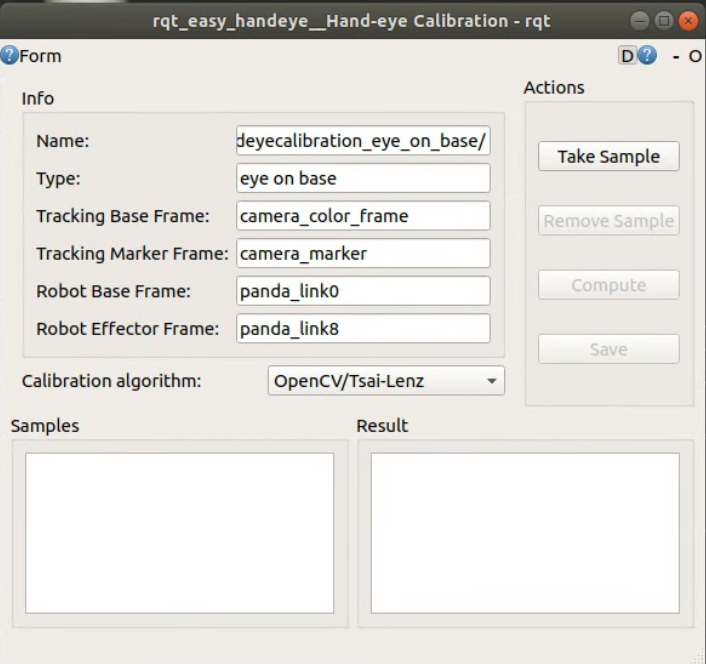

### 1 打开标定相关package
```Shell
roslaunch easy_handeye panda_rs_calibration.launch
```
打开后会跳出三个GUI，但我们仅使用如下的这个GUI，用于采集每个标定点的数据和机械臂的相关参数。

### 2 打开 rqt image view确保码被检测到
```Shell
rqt_image_view
```
打开后在左上角的topic处选择如下的topic
```Shell
/aruco_tracker/result
```

确保能看到aruco码被detect到。
### 3 打开标定机械臂标定程序（用于移动机械臂到不同的点和角度）
```Shell
python /home/a/catkin_ws/src/calibration/easy_handeye/easy_handeye/scripts/handeye_calibration_inhand.py
```
打开后会跳出如下的GUI，这个程序运行的逻辑是会持续render一个window，在window内按b可以使机械臂运动到下一个位置。

### 4 标定
机械臂每运动到一个新的位置，点一下1中GUI中的**Take Sample**的button，看到数据被记录后，重新点一下3中的window，并按一下b，待机械臂运动完成后，重新记录当前位置的信息，以此类推，直到window自动close，也就是点全部采完。

在采集过程中会碰到如下情况：
4.1 码检测不准确，码的边框在持续晃动或者码时有时无，这说明检测不稳定，一般不建议采集改点，可直接按b跳过当前位置。
4.2 无法检测到码，一般因为反光，角度不好等原因会出现码无法检测到的情况，对于这种情况，也直接按b跳过当前位置。（对于这种情况，千万不要点**Take Sample**的button，这会导致程序直接crash）
   
全部检测完成后，点击1中GUI中的**Compute**得到标定后的相机参数。
### 5 标定结果评估
5.1 将4中得到的相机参数填入如下路径文件中的32行
```Shell
/home/a/catkin_ws/src/calibration/easy_handeye/easy_handeye/scripts/calibration_test.py
```
5.2 关闭1中的launch文件（注意，先完成5.1再关闭launch），放置一个明显的标识物至相机视野中，运行如下程序（由于该程序含有中文注释，需切换python或用vscode debugging模式运行）
```Shell
/home/a/catkin_ws/src/calibration/easy_handeye/easy_handeye/scripts/rs_get3d.py
```
运行程序后，会看到如下GUI。

将鼠标置于某个你希望机械臂运动到的点，从上述GUI的左下角读取像素点的坐标，并修改至5.2的python文件中的第49，50行。重新运动该程序，待terminal中print的数值稳定后，将读取到的点的三维坐标修改至5.1中的python文件的34行。

5.3 启动机械臂的驱动程序
```Shell
roslaunch franka_interface interface.launch
```
5.4 运动5.1中的python文件
```Shell
python /home/a/catkin_ws/src/calibration/easy_handeye/easy_handeye/scripts/calibration_test.py
```
待机械臂运动到指定位置，评估精度误差，一般误差不会超过1cm。
