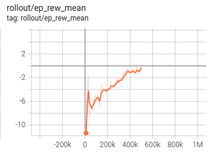

前置：
- [[dev-env]]
- [[anaconda]]和[[pip]]（推荐把源设置成清华源等国内的）
- 时至2022.1.17
  - 不要拿vscode集成终端或者`launch.json`跑
    - 推测：和electron的权限有关，参见[[7-permissions]]
  - 不要让standalone的`.py`脚本离开默认位置！
  - 否则都不能跑。原因暂未知。可能是isaac不够成熟。

## 准备包
- [pytorch](https://pytorch.org/)
（来自pytorch官网）命令示例（2022.1.15）：`conda install pytorch torchvision torchaudio cudatoolkit=11.3 -c pytorch`
成功后的效果
```sh
$ python         
Python 3.7.11 (default, Jul 27 2021, 14:32:16) 
[GCC 7.5.0] :: Anaconda, Inc. on linux
Type "help", "copyright", "credits" or "license" for more information.
>>> import torch
>>> torch.cuda.device_count()
2
```
- [stable-baselines3](https://stable-baselines3.readthedocs.io/en/master/guide/install.html)
> Stable-Baselines3 requires python 3.7+ and PyTorch >= 1.8.1.

按照官网所说，即`pip install stable-baselines3[extra]`（用的shell是bash，否则中括号可能有问题）
## 开始训练
根据[指示](https://docs.omniverse.nvidia.com/app_isaacsim/app_isaacsim/tutorial_advanced_rl_stable_baselines.html)，启动并观察训练过程
```sh
cd ~/.local/share/ov/pkg/isaac_sim-2021.2.1/
cd standalone_examples/api/omni.isaac.jetbot/stable_baselines_example
```
然后
- 官网给的是`~/.local/share/ov/pkg/isaac_sim-2021.2.1/python.sh train.py`
- 但是如果你加了`$PATH`（参考[[6-env]]）那就可以直接`python.sh train.py`
- 进一步如果你按照[[dev-env]]中`anaconda`一节相关的设置了，就可以`isaac-sim-py`之后直接`python train.py`
注：显然根据[这个](https://docs.omniverse.nvidia.com/app_isaacsim/app_isaacsim/tutorial_required_workflows.html#standalone-application)，本脚本属于standalone application

然后同一个目录另开一个终端（`Ctrl + Shift + T`）
- 按照官网，`<某某> ~/.local/share/ov/pkg/isaac_sim-2021.2.1/tensorboard --logdir ./`启动tensorboard
- 其中`<某某>`是什么和之前是同理的。比如`isaac-sim-py`之后直接`python`就行
- tensorboard用法参见[[tensorboard]]
## 验证
耐心等它训完
```text
| rollout/                |              |
|    ep_len_mean          | 1e+03        |
|    ep_rew_mean          | 0.181        |
| time/                   |              |
|    fps                  | 119          |
|    iterations           | 50           |
|    time_elapsed         | 4185         |
|    total_timesteps      | 500000       |
| train/                  |              |
|    approx_kl            | 0.0034707766 |
|    clip_fraction        | 0.00994      |
|    clip_range           | 0.2          |
|    entropy_loss         | -2.36        |
|    explained_variance   | -1.19e-07    |
|    learning_rate        | 0.00025      |
|    loss                 | 0.352        |
|    n_updates            | 490          |
|    policy_gradient_loss | -0.000848    |
|    std                  | 0.787        |
|    value_loss           | 0.752        |
```
- tensorboard可以看到不错的结果!
- 然后运行跟前面`train.py`同一路径的`eval.py`即可看到GUI中运行结果
  - 其中要手动改`eval.py`里的文件名去看具体哪个epoch
  - 例如改成`policy_path = "./mlp_policy/jetbot_policy_checkpoint_300000_steps.zip"`
感觉这不太规范啊233