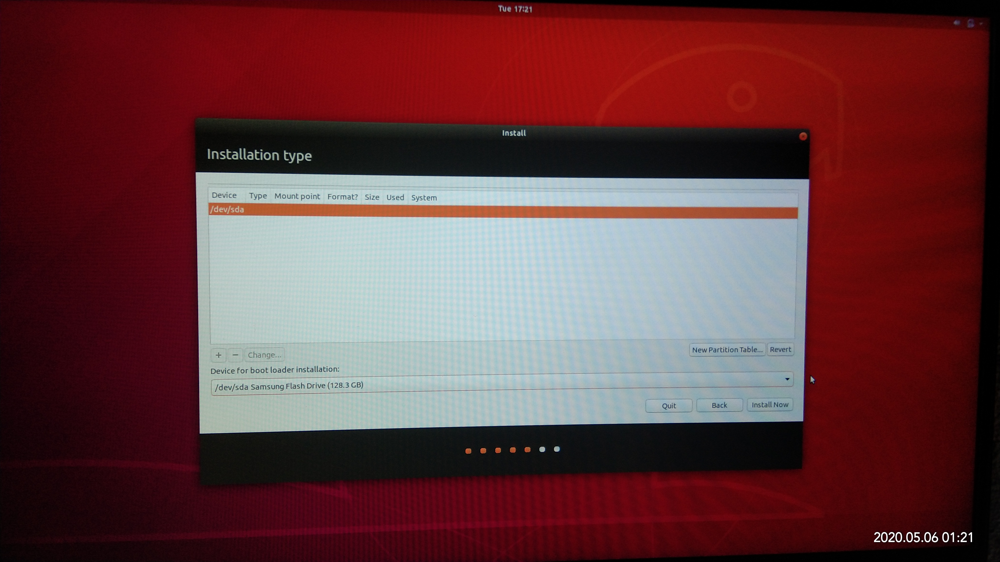

本篇是基于Win10装Ubuntu18.04. 其它系统安装中，有些操作是类似的。
# Windows+Ubuntu双系统安装

参考资料：https://www.cnblogs.com/xlpc/p/12324535.html
tags: #双系统 #Linux #Windows10

1. 参考[[dual-boot-partition]]在Win10中重分区
2. `Win+R`，输入`msinfo32`并运行，看到BIOS模式
   新电脑基本都是UEFI. 以下都针对UEFI
3. [[制作U盘启动盘]]
4. 插入U盘启动盘，重启电脑[[进入BIOS]]，在boot manager里将secure boot设置为disabled，并选择boot设备为U盘，保存退出
   1. 注：由于机器型号不同，选择boot设备为U盘的具体操作可能不同。有的是调整优先级使得U盘排第一，有的是直接选择U盘。
5. 进入ubuntu安装界面。一步步按照指示进行。其中分区参考[[dual-boot-partition]]
6. （可选）如果按照[[dual-boot-partition]]顺利做了设置使得windows boot manager和ubuntu的boot在同一块盘，则之后boot始终让ubuntu优先级最高就非常方便。每次开机的时候只需上下键选择即可切换ubuntu和windows
反之，默认boot为windows则不方便切换至ubuntu
## Troubleshooting
1. 在“安装类型”步骤出错：安装类型列表为空，如图。
   (图片来自网络)
   1. [参考资料](https://blog.csdn.net/weixin_43644231/article/details/105944192)
在BIOS中将SATA Controller Mode设置为AHCI模式。
   2. 之后为保证Windows系统能够运行，使用安全模式运行一次Windows系统，并重启，切换回ubuntu.
注：有些比较新的机型就没有AHCI问题。BIOS中甚至找不到SATA选项。那就不用设，直接可以用。
2. 没有进入安装界面，直接ACPI错误，花屏。这是独显 #GPU 的锅
   如果是台式，可以直接把显示器接到集显，装好系统再配置独显驱动。否则
   1. 安装前
      在**出现`Try Ubuntu`，`Install`等选项的那个[[grub-menu]]**，根据界面下方提示，按小写`e`，进入编辑界面
      在里面把某一行末尾的`---`改成`nomodeset`，然后根据下方提示按`Ctrl + X`或者`F10`继续安装
   2. 安装完成，reboot，进入第一次启动前的[[grub-menu]]（这个grub菜单显示的选项和安装时的不同，但是样式类似
   和1.做几乎一样的操作（也是临时改一下选项。这次是最后一次临时改了，因为接下来进去系统就可以永久改了）
   3. 进入系统后，`sudo vim /etc/default/grub`进行编辑
      找到`GRUB_CMDLINE_LINUX_DEFAULT=quiet splash`，改成`GRUB_CMDLINE_LINUX_DEFAULT=quiet splash nomodeset`，保存文件退出
      运行命令`sudo update-grub`
      之后再启动就都没问题了
      注：可以和[[ubuntu-nvidia-brightness]]和[[ubuntu-nvidia-drivers]]的重启一起进行